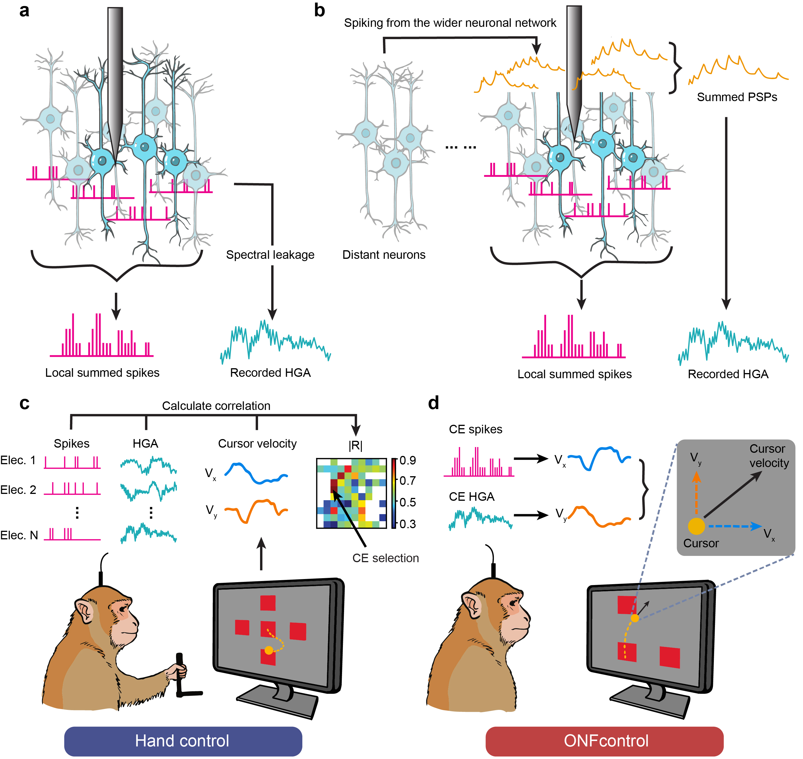

# Spike-HighGamma Analysis

An analysis pipeline for investigating the relationship between neural spike activity and high-gamma band activity (HGA) in non-human primates during a novel brain computer interface task.

## Overview

This repository contains tools and analysis notebooks for studying neural population activity recorded from multi-electrode arrays implanted in motor cortex. The project addresses a fundamental question in neuroscience: **What is the biophysical source of high-gamma band activity (HGA)?**

Two leading hypotheses exist:
1. HGA predominantly represents summed **postsynaptic potentials**
2. HGA predominantly represents summed **local spikes**

If HGA were simply summed local spiking, the nearest neurons to an electrode should contribute most to the recorded HGA. To test this, we trained non-human primates to **actively decouple local spiking from HGA** on a single electrode using a brain-machine interface. The subjects' ability to successfully decouple these signals provides strong evidence that HGA is not simply generated by summed local spiking.

**Main Findings:**
- Local spiking and HGA can be actively dissociated through volitional control
- HGA correlates with neuronal population co-firing across **widely distributed neurons** (spanning millimeters)
- Neurons contributing more to population co-firing also contribute more to, and precede, spike-triggered HGA
- **Conclusion:** HGA arises predominantly from summed postsynaptic potentials triggered by synchronous co-firing of widely distributed neurons, rather than from local spiking activity




## Project Structure

```
spike-highgamma/
├── behavior_analysis.ipynb           # Behavioral performance and cursor trajectory analysis
├── neural_signal_analysis.ipynb      # Neural signal correlation analysis
├── STA_analysis.ipynb                # Spike-triggered average analysis
├── subspace_analysis.ipynb           # Subspace analysis using PCA and cPCA
├── utility_functions.py              # Core utility functions and data loading
├── environment.yaml                  # Conda environment specification
└── data/                            # Data directory (excluded from version control)
    ├── trials/                      # Full trial data
    ├── last4s/                      # Last 4 seconds of trials
    ├── STA/                         # Spike-triggered average data
    ├── metadata/                    # Electrode mapping and metadata
    └── shunted_electrodes.mat       # Information about shunted electrodes
```

## Features

### Analysis Notebooks

1. **Behavior Analysis** ([behavior_analysis.ipynb](behavior_analysis.ipynb))
   - Cursor trajectory visualization
   - Success rate analysis
   - Trial-by-trial behavioral performance
   - Day-by-day behavioral trends

2. **Neural Signal Analysis** ([neural_signal_analysis.ipynb](neural_signal_analysis.ipynb))
   - Correlation between spike activity and high-gamma band activity
   - Spatial distribution analysis across electrode arrays
   - Temporal dynamics during task performance
   - Neural-behavioral correlation analysis

3. **Spike-Triggered Average Analysis** ([STA_analysis.ipynb](STA_analysis.ipynb))
   - Spike-triggered average (STA) computation
   - Factor analysis of neural population activity
   - Clustering analysis of neural patterns
   - Spatial mapping of STA features

4. **Subspace Analysis** ([subspace_analysis.ipynb](subspace_analysis.ipynb))
   - Principal Component Analysis (PCA)
   - Factor Analysis
   - Contrastive PCA (cPCA) for identifying task-relevant neural dimensions
   - Linear regression for neural decoding

### Utility Functions

The `utility_functions.py` module provides essential functions for:

- **Data Loading**: Load trial data, STA data, and metadata from `.mat` files
- **Electrode Mapping**: Handle electrode grid layouts and coordinate transformations
- **Spatial Analysis**: Calculate distance-based weights and visualize data on electrode grids
- **Statistical Utilities**: Significance testing and data preprocessing
- **Dimensionality Reduction**: Custom implementations of cPCA and covariance analysis

## Installation

### Prerequisites

- Python 3.8
- Conda (recommended for environment management)

### Setup

1. Clone the repository:
```bash
git clone https://github.com/caraido/spike-highgamma.git
cd spike-highgamma
```

2. Create and activate the conda environment:
```bash
conda env create -f environment.yaml
conda activate spike-highgamma
```

### Dependencies

- **numpy**: Numerical computations
- **scipy**: Scientific computing and signal processing
- **scikit-learn**: Machine learning and dimensionality reduction
- **pandas**: Data manipulation and analysis
- **mat73**: Loading MATLAB v7.3 files
- **matplotlib**: Data visualization
- **contrastive**: Contrastive PCA implementation

## Data Structure

The analysis expects data organized by monkey subjects (identified by letters: C=Chewie, J=Jaco, M=Mini) and electrode numbers. Each trial contains:

- **spike_rate**: Neural firing rates
- **HGA**: High-gamma band activity (filtered and processed)
- **position**: Cursor position trajectories
- **velocity**: Cursor velocity
- **trial_types**: Task condition labels
- **target_types**: Target location information
- **file_types**: Session type (learned/adaptive)

## Key Analysis Methods

### Spike-Triggered Average (STA)
Computes the average high-gamma activity surrounding each spike event to identify temporal patterns of neural population activity.

### Contrastive PCA (cPCA)
Identifies neural subspaces that distinguish between different task conditions (e.g., foreground vs. background activity, different movement directions).

### Spatial Decay Analysis
Models the spatial spread of neural activity across the electrode array using distance-based decay functions:
```
weight = 1 / d^power
```
where `d` is the Euclidean distance between electrodes.

## Data Availability

Due to file size constraints and data sharing agreements, the `data/` directory is excluded from version control. Please refer to the Data Availability section in the paper.

## Citation

This code accompanies the following publication:

**Lei, T., Scheid, M. R., Flint, R. D., Glaser, J. I., & Slutzky, M. W.** (2026). Active Dissociation of Intracortical Spiking and High Gamma Activity. *Nature*. [https://doi.org/10.1101/2025.07.10.663559](https://www.nature.com/articles/s41586-026-10331-y)

If you use this code in your research, please cite the paper above.

## Contributing

This repository contains analysis code developed by:

- **Tianhao Lei** - Primary author and code developer

For questions, suggestions, or bug reports, please open an issue on GitHub.

## License

This project is licensed under the [Creative Commons Attribution-NonCommercial 4.0 International License (CC-BY-NC 4.0)](http://creativecommons.org/licenses/by-nc/4.0/).

You are free to:
- **Share** — copy and redistribute the material in any medium or format
- **Adapt** — remix, transform, and build upon the material

Under the following terms:
- **Attribution** — You must give appropriate credit, provide a link to the license, and indicate if changes were made
- **NonCommercial** — You may not use the material for commercial purposes

## Contact

For questions or data access requests:
- **Tianhao Lei**: tianhaolei2019@u.northwestern.edu
- **Marc W. Slutzky**: mslutzky@northwestern.edu

You can also open an issue on GitHub for technical questions or bug reports.
